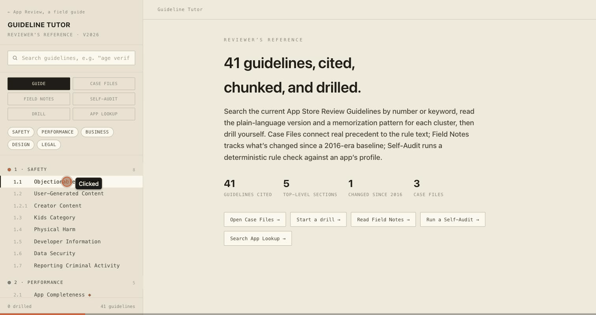

# App Review Guideline Tutor



Live: **[appreview.atharux.com/tutor](https://appreview.atharux.com/tutor/)**

A reviewer's reference for the current App Store Review Guidelines — cited,
explained in plain language, chunked for memorization, and drillable. Built
because reading the official guidelines document and actually retaining
which rule bites which app is a different skill, and most people are never
taught the second one.

## What it does

- **Guidelines** — every current App Store Review Guideline, cited by
  number, with a plain-language explanation and a memorization pattern per
  cluster (Safety, Performance, Business, Design, Legal).
- **Drill** — a self-quiz mode: see a citation, recall the rule before
  revealing it, track how many you've drilled.
- **Case Files** — real, documented precedent cross-referenced against the
  guideline text, so a rule isn't just abstract wording.
- **Field Notes** — a changelog of what's shifted since a 2016-era
  baseline, because the guidelines are a living document, not a fixed text.
- **Self-Audit** — a deterministic rule check against an app's profile
  (not an AI guess — the same rules, applied consistently).
- **App Lookup** — a live search against Apple's public iTunes Search API,
  so you can pull up a real app's actual listing while reading the rules
  that would apply to it.

## Honesty by design

Case files are seeded with real, documented precedent; anything you add
manually is clearly distinguished from that, never blended in as if it
were pre-verified. The App Lookup hits Apple's own public API directly —
nothing here is scraped, cached, or presented as more current than it is.

## Scope

Built from the public App Store Review Guidelines and Human Interface
Guidelines. This is a study and reference tool, not a substitute for a
professional pre-submission audit — the Self-Audit here runs a fixed,
visible rule set; a real audit engagement goes deeper and is judgment-
intensive in ways a static tool can't be. Not an official Apple tool, and
using it is not a guarantee of App Store approval.

## Stack

Single self-contained HTML file. No build step, no dependencies, no
backend — the only network call is the live App Lookup, direct to Apple's
public search API. Design tokens are the lightMuseum house system (warm
paper, DM Mono + Space Grotesk), shared with the rest of
[appreview.atharux.com](https://appreview.atharux.com).

## Development

It's one file. Open `index.html` in a browser, or serve it with anything
static:

```bash
npx serve .
```
